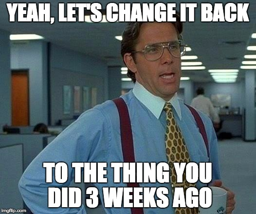

```{r setup, include=FALSE}
knitr::opts_chunk$set(echo = FALSE, 
                      warning = FALSE, 
                      message = FALSE)
```


## Carson Sievert

<div class="container"> 
   <div class="left-half" style="font-size: 28pt;">

Create an R interface that is easyfor the user and just "works"

Plotly is awesome 
  - R package easiest implementation of quick, great interactive graphics
  - but still bound to plotly.js and its implementations

</div>
   <div class="right-half" style="font-size: 20pt;">
   
  </div>
</div> 

## Leo Collado Torres

<div class="container"> 
   <div class="left-half" style="font-size: 28pt;">

- Interactive Graphics are good, but have some drawbacks
- Re-use other tools 
- Make it fast and simple
- Iterative 
- Minimize user options: make a decision 

</div>
   <div class="right-half" style="font-size: 20pt;">


</div>
</div>


# My opinion: `ggplotly` makes `ggplot2` > `base`

## Interactive Graphics are Hard


## Interactive Graphics <s>are</s> were Hard

<div class="container" style="font-size: 28pt;"> 
<div class="left-half">

- ggobi/xgobi
- plotly (and `ggplotly`)
- htmlwidgets
- Shiny
- manipulate 
- ggvis/vegalite
- rCharts

</div>
<div class="right-half">

- rbokeh: http://hafen.github.io/rbokeh/
- trelliscope: http://deltarho.org/docs-trelliscope/
- crosstalk: http://rstudio.github.io/crosstalk/
- p5*
</div>


# Interactive Graphics are "Catching up to the 90s" <br> (Di Cook)

# Use of interactive graphics is increasing <br> (I think)

## Custom Interactive Graphics are Still Hard

<div class="left-half" style="font-size: 28pt;">

- GGobi is the standard to ascribe to in many ways (I haven't used extensively)
- Implementing many of these widgets for HTML would be good
    - \*cough\* PhD Thesis \*cough\*

</div>

## Yesteryears in R: PDF with multiple images


## Some rules for using interactive graphics

<div class="container" style="font-size: 28pt;">

To start:

1. Make it simple 
2. Give few choices, if any
3. Ask for specific feedback
4. Make it fast, use tools available even if clunky.  
    - I tend to use Shiny to prototype

</div>

## Interactive graphics

- Using interactive graphics

## Collaboration and interactive graphics

1. Shiny is good, but can't be emailed
    - Need a Server (Digital Ocean has tutorial)
2. HTML and JavaScript is backended for most (or all) of what we discussed
3. 

## But I don't use R!

<div class="container" style="font-size: 28pt;">

- Python has a lot of implementations similar to what we've discussed
- Dash: Interactive, reactive web apps in pure python (from Plotly)
- Stata: stata2leaflet, stata2d3 (never have used them)
- SAS

</div>


